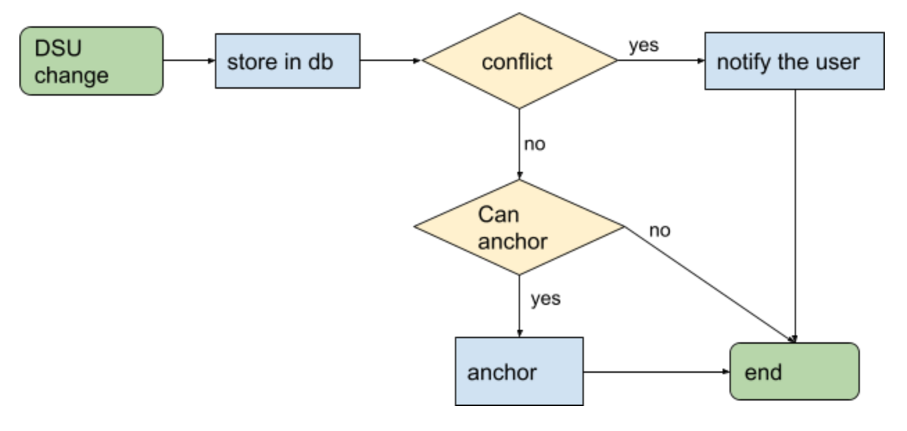

# db module
Aimed for storing DSU related metadata, that can be used for delegated conflict solving or further analysis.

DB by itself is mean to perform only conflict free operation while writing,
this is managed by introducing a db schema where each user changes are stored separately and using mostly commutative operations.
Operations can yield conflict by definition such as `set` shall be used only in non-conflicting manner by setting data under a unique key and never resetting them (this does not mean that nested mutation are disallowed). 

## Data Flowchart

